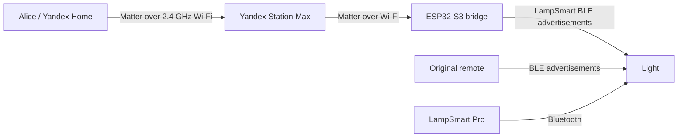

# ESP32 Matter-to-BLE Light Bridge

A local bridge for ceiling lights controlled by the
[LampSmart Pro](https://play.google.com/store/apps/details?id=com.jingyuan.lamp)
app, a physical BLE remote, and compatible controllers. The ESP32-S3 receives
Matter commands over Wi-Fi and retransmits them as proprietary BLE
advertisements understood by the light.

The project has been tested with an ESP32-S3, a light using the LampSmart `v1a`
protocol, and a Yandex Station Max. Once configured, it does not require a
mini-PC or an always-on server.

> This is experimental firmware intended for personal use. It uses test Matter
> VID/PID values and test device attestation supplied by ESP-Matter. A production
> device requires its own commissioning data, DAC/PAI/CD, and certification.

## Features

- power on and off;
- brightness control;
- cool, neutral, and warm white;
- RGB color;
- control from the Yandex Home with Alice app and by voice through Alice;
- automatic restoration of Wi-Fi, the Matter fabric, and the last light state
  after an ESP32 restart;
- simultaneous use of the original remote and LampSmart Pro;
- separate firmware for capturing the remote and manually testing commands from
  macOS or Linux.



Matter runs over Wi-Fi. Bluetooth is used during initial Matter commissioning
and then by the ESP32 itself to transmit commands to the light.

## Compatibility

The current Matter bridge transmits LampSmart `v1a` packets. The sniffer can
recognize `v1a`, `v1b`, `v2`, and `v3`, but the Matter transmitter must be
ported before it can control variants other than `v1a`.

Tested configuration:

| Component | Version/model |
| --- | --- |
| MCU | ESP32-S3, 4 MB flash |
| ESP-IDF | v5.5.4 |
| ESP-Matter | commit `177452a85301875f8f5a5865b8836f39d0953092` |
| connectedhomeip | commit `efefc94fee39d8d1fbbc3c27b9d7fc9025095887` |
| Matter controller | Yandex Station Max |
| Lamp protocol | `v1a`, controller ID `0x5018`, subgroup `1` |

Other ESP32 models with Wi-Fi and BLE may require changes to CMake, the
partition table, and the BLE code. The target is intentionally fixed to
`esp32s3` for now.

## Quick start

1. Set up ESP-IDF and ESP-Matter by following
   [docs/INSTALL.md](docs/INSTALL.md).
2. If the original remote's ID is unknown, flash the sniffer:

   ```sh
   ./idf.sh -C sniffer set-target esp32s3
   ./idf.sh -C sniffer -p /dev/cu.YOUR_PORT flash monitor
   ```

   Press a button on the remote and record `variant`, `id`, and `index` from the
   `FOUND` line. See [docs/PROTOCOL.md](docs/PROTOCOL.md) for details.
3. Configure the captured group:

   ```sh
   ./idf.sh -C matter menuconfig
   ```

   Open `LampSmart bridge` and set `LampSmart controller ID` and
   `LampSmart subgroup index`.
4. Build and flash the Matter bridge:

   ```sh
   ./idf.sh -C matter build
   ./idf.sh -C matter -p /dev/cu.YOUR_PORT flash monitor
   ```

5. Print the QR code and manual code in the ESP32 console:

   ```text
   matter onboardingcodes ble
   ```

6. In the Yandex Home with Alice app, open
   `+` → `Smart home device` → `Find Matter devices`, scan the QR code, and
   select the Yandex Station Max as the hub.

The phone, Station, and ESP32 must be on the same regular local network. Use a
2.4 GHz Wi-Fi network during commissioning. Practical checks and common errors
are covered in [docs/TROUBLESHOOTING.md](docs/TROUBLESHOOTING.md).

## Repository layout

| Path | Purpose |
| --- | --- |
| `matter/` | primary Matter over Wi-Fi to LampSmart BLE bridge |
| `sniffer/` | passive capture and decoding of remote packets |
| `main/` | interactive USB controller for testing protocol commands |
| `managed_components/` | pinned subset of `esp-lampsmart-ble` used by the test firmware |
| `idf.sh` | launcher for the locally installed ESP-IDF/ESP-Matter toolchain |
| `docs/PROTOCOL.md` | packet format, commands, and reverse-engineering process |
| `THIRD_PARTY_NOTICES.md` | third-party licenses and attributions |

## State after a restart

Wi-Fi credentials, Matter fabrics, and light attributes are stored in NVS. On
startup, firmware on an already commissioned board reads the saved `OnOff`,
brightness, and color attributes, then retransmits that state to the light. If
NimBLE is temporarily busy, transmission is retried.

The LampSmart protocol is one-way: the light does not report its actual state
to the ESP32. A command from the original remote therefore does not update the
Matter device card. The next Alice command or bridge restart reapplies the saved
Matter state.

## License

Original project code is distributed under the [MIT License](LICENSE).
Third-party components retain their original licenses; pinned versions,
attributions, and binary-distribution requirements are listed in
[THIRD_PARTY_NOTICES.md](THIRD_PARTY_NOTICES.md). The required Matter SDK notice
is included in [NOTICE](NOTICE).

## Useful links

- [ESP-Matter Programming Guide](https://docs.espressif.com/projects/esp-matter/en/latest/esp32/developing.html)
- [Matter in Yandex Home with Alice](https://alice.yandex.ru/support/ru/smart-home/turn-on/matter)
- [Matter devices supported by Yandex](https://alice.yandex.ru/support/ru/smart-home/supported-matter-devices)
- [Upstream esp-lampsmart-ble component](https://github.com/QB4-dev/esp-lampsmart-ble)

This project is not affiliated with the manufacturers of LampSmart Pro, the
light, or Yandex.
